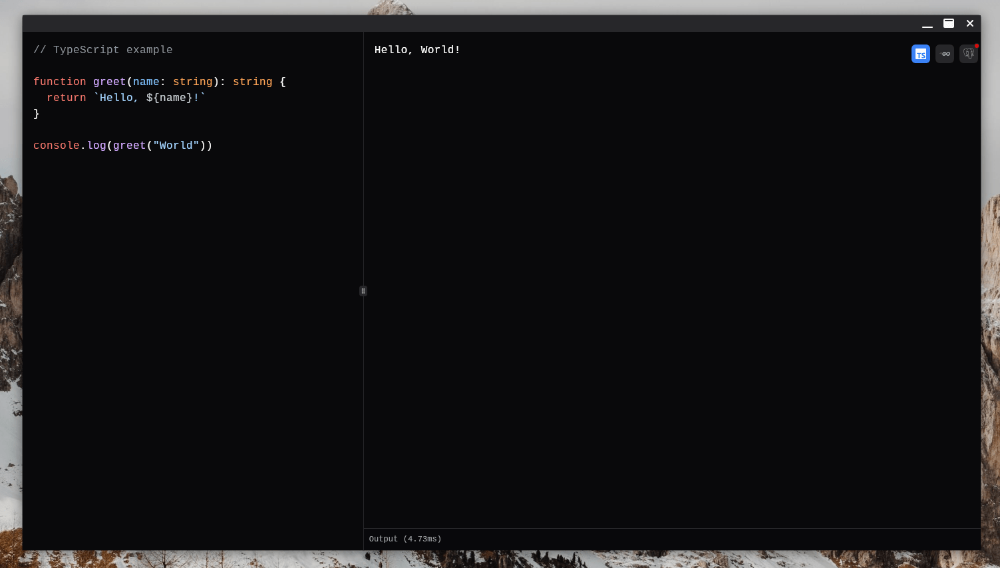
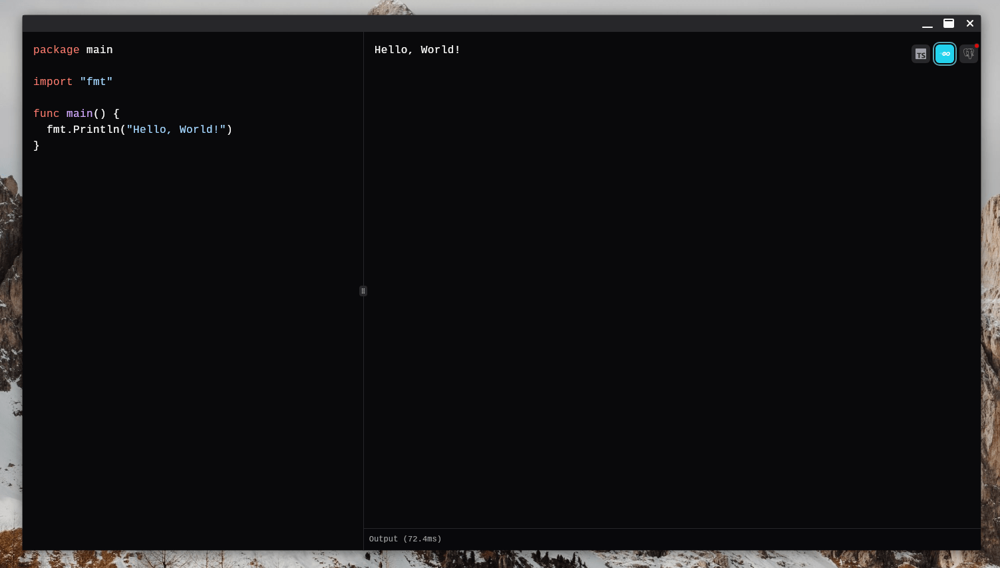
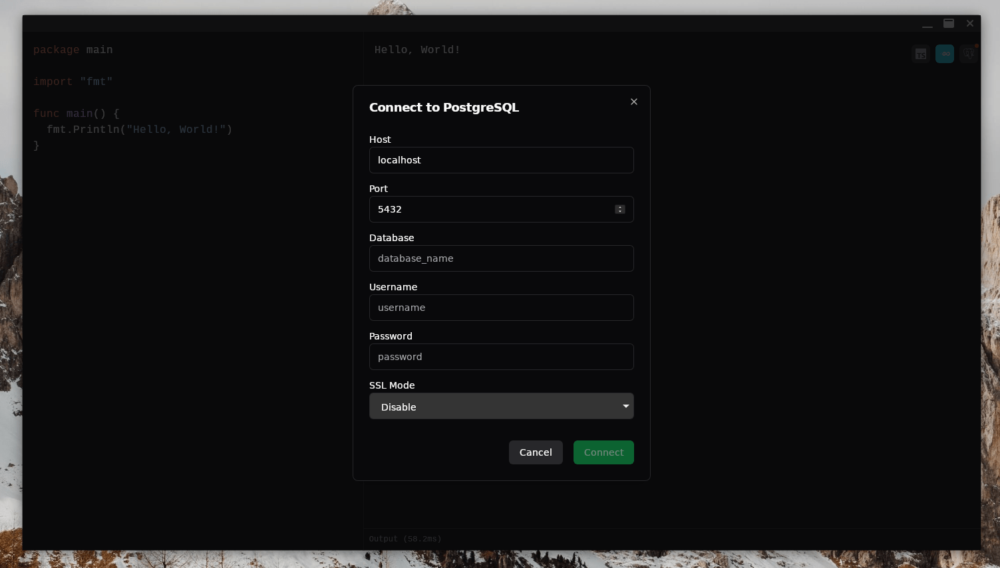
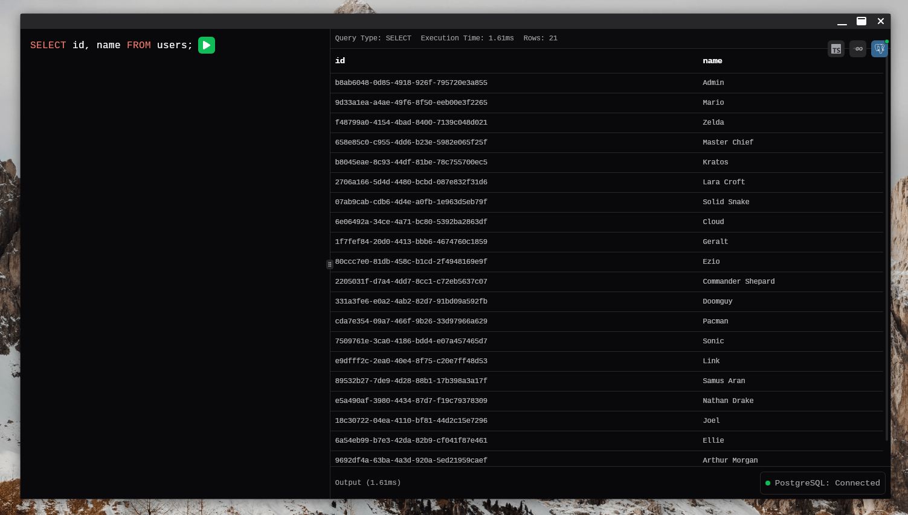

# Code Zone

A fast, offline desktop code playground for JavaScript, TypeScript, Go, and SQL. Built with Go and Wails for lightning-fast performance.

> **Note**: This is a lightweight executor designed for testing small code snippets with nice preview and syntax highlighting. It's perfect for quick experiments, learning, and small-scale development tasks.

## 🚀 Features

- **Multi-language Support**: Execute JavaScript, TypeScript, Go, and SQL queries
- **Offline First**: No internet required - everything runs locally
- **Lightning Fast**: Built with Go for exceptional performance
- **Modern UI**: Dark theme with resizable panels and intuitive interface
- **Real-time Execution**: See results instantly as you code
- **PostgreSQL Integration**: Connect to databases and run SQL queries
- **Cross-platform**: Works on Windows, macOS, and Linux

## 📸 Screenshots

### JavaScript/TypeScript

_Write and execute JavaScript/TypeScript code with instant feedback_

### Go

_Compile and run Go programs with full standard library support_

### SQL/PostgreSQL

_Connect to PostgreSQL databases_

_Execute queries with formatted results_

### Getting Started

1. Launch Code Zone
2. Select your preferred language from the top-right dropdown
3. Write your code in the left panel
4. View results in the right panel

### Language-Specific Features

#### JavaScript/TypeScript

- Full ES2022+ support
- TypeScript compilation
- Real-time error checking

> **Windows Users**: TypeScript support on Windows has limitations with modern ES2016+ features (arrow functions, template literals, const, let, etc.). For full ES2016+ support, please install Node.js from [nodejs.org](https://nodejs.org/). The app will automatically use Node.js when available, otherwise it will use the built-in JavaScript engine with limited feature support.

#### Go

- Full Go standard library
- Fast compilation and execution

#### SQL/PostgreSQL

- Connect to PostgreSQL databases
- Execute SELECT, INSERT, UPDATE, DELETE queries
- View results in formatted tables
- Connection status monitoring

### Tips

- Autosave and auto code execution
- Resize panels by dragging the divider
- Switch languages anytime without losing your code
- Check the connection status for PostgreSQL in the language switcher
- Get data about speed of code and queries execution

## 🏗️ Architecture

Code Zone is built with:

- **Backend**: [Go](https://golang.org/) with custom executors for each language
- **Frontend**: [SolidJS](https://www.solidjs.com/) with [TypeScript](https://www.typescriptlang.org/)
- **UI**: [Solid UI](https://solid-ui.com/) custom components with dark theme
- **Framework**: [Wails](https://wails.io/) for desktop app capabilities
- **Key Libraries**: 
  - [V8](https://github.com/v8/v8) (JavaScript engine for Unix)
  - [Otto](https://github.com/robertkrimen/otto) (JavaScript engine for Windows)
  - [highlight.js](https://github.com/highlightjs/highlight.js) (syntax highlighting)
  - [esbuild](https://github.com/evanw/esbuild) (TypeScript compilation)

## 🚀 Performance

- **Offline execution**: No network dependencies
- **Fast startup**: Instant app launch
- **Efficient execution**: Go-powered language runtimes
- **Minimal resource usage**: Lightweight desktop app

## 📄 License

MIT License - see [LICENSE](LICENSE) file for details.

## 🤝 Contributing

Contributions are welcome! Please feel free to submit a Pull Request.

## 📞 Support

If you encounter any issues or have questions, please [open an issue](https://github.com/sklymoshenko/codezone/issues).

---

**Built with ❤️ using Go and Wails**
